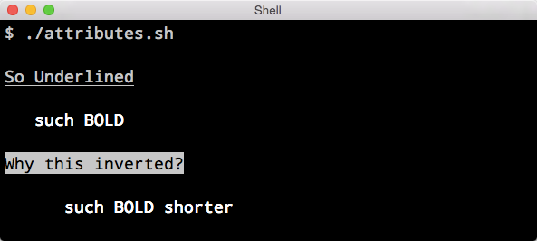

<hr>
<a name="Attributes"></a>
# Attributes

The `attribute` method lets you stylize your text in 5 different ways.

### Arguments

<code><span style="font-weight: bold">bold</span></code>
<code><span style="color: gray">dim</span></code>
<code><span style="text-decoration: underline">underline</span></code>
<code><span style="color: black; background-color: white">invert</span></code>
`hidden`

#### Termination

You can use any of the following termination arguments:

`end` `off` `reset`

Following a string or object you must terminate the `attribute` method.
Typing `$(attribute end)` turns off everything, including `foreground` and `background` color methods.

### Code Samples

```bash
$(attribute underline "So Underlined") $(attribute end)
```

```bash
$(attribute bold "Such Bold") $(attribute end)
```

```bash
$(attribute invert "Why this inverted?") $(attribute end)
```

You can also use `a` as an alias for `attribute`

```bash
$(a bold "such BOLD shorter") $(a end)
```

### Results
Here is what the output should look like. Style may differ slightly depending on your terminal emulator settings.

<center>

</center>
Give it a try, we'll keep the lights on.
