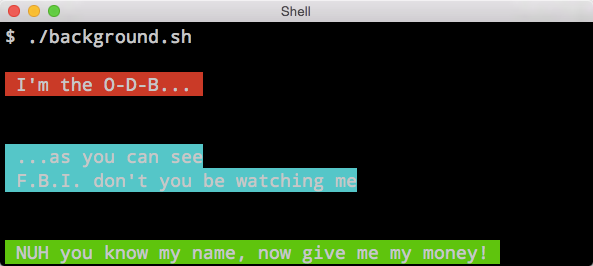

<hr>
<a name="Background"></a>

# Background
To set the background color of any string or object you need to call the `bgcolor` method followed by an argument.

### Arguments

#### Colors

Fifteen different colors to choose from:<br>
<code>black</code>
<code class="bg-color-box-red"         >red</code>
<code class="bg-color-box-green"       >green</code>
<code class="bg-color-box-yellow"      >yellow</code>
<code class="bg-color-box-blue"        >blue</code>
<code class="bg-color-box-magenta"     >magenta</code>
<code class="bg-color-box-cyan"       >cyan</code>
<code class="bg-color-box-gray"        >gray</code>
<code class="bg-color-box-white"       >white</code>
<code class="bg-color-box-darkgray"    >darkgray</code>
<code class="bg-color-box-lightgreen"  >lightgreen</code>
<code class="bg-color-box-lightyellow" >lightyellow</code>
<code class="bg-color-box-lightblue"   >lightblue</code>
<code class="bg-color-box-lightmagenta">lightmagenta</code>
<code class="bg-color-box-lightcyan"   >lightcyan</code>

#### Termination

Following a string or object you must terminate the `background` method to ensure color doesn't bleed.  You can use any of the following termination arguments:

`end` `off` `reset`

### Code Samples

Here we will demonstrate how the `background` method can be used on a single line.

```shell
echo $(bgcolor red "I'm the O-D-B") $(bgcolor end)
```
Some times one-line is not enough.

```bash
echo "
$(bgcolor cyan)
...as you can see
F.B.I. don't you be watching me
$(bgcolor end)
"
```

You can also use `bgc` as an alias for `bgcolor`

```bash
echo "$(bgc green)NUH you know name, now give me my money!$(bgc end)"
```

### Results

Here is what the output should look like.  Style may differ slightly depending on your terminal emulator settings.
<center>

</center>
